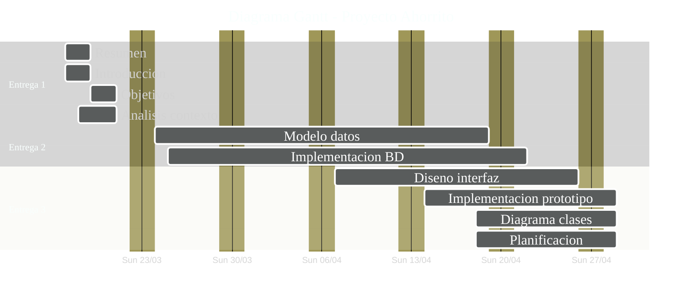

# Planificación del Proyecto Ahorrito

## Tabla de Hitos

| Hito      | Entrega                        | Descripción                                                                                                                                           | Fecha inicio | Fecha fin |
| --------- | ------------------------------ | ----------------------------------------------------------------------------------------------------------------------------------------------------- | ------------ | --------- |
| Entrega 1 | Introducción y Objetivos       | • Resumen • Introducción • Objetivos • Análisis del contexto                                                                                 | 17/03/25     | 21/03/25  |
| Entrega 2 | Modelo de datos                | • Modelo de datos • Implementación de la BD                                                                                                        | 24/03/25     | 28/03/25  |
| Entrega 3 | Diseño de la interfaz          | • Diseño de la interfaz • Implementación de las pantallas con funcionalidad parcial (prototipo) • Diagrama de clases inicial • Planificación | 07/04/25     | 11/04/25  |
| Entrega 4 | Implementación                 | • Implementación de la funcionalidad de la aplicación                                                                                                 | 28/04/25     | 02/05/25  |
| Entrega 5 | Puesta en marcha y explotación | • Puesta en marcha, explotación • Prueba y control de calidad • Gestión económica o plan de empresa                                             | 19/05/25     | 23/05/25  |
| Entrega 6 | Código fuente                  | • Documentación completa • Código fuente                                                                                                           | 09/06/25     | 13/06/25  |

## Diagrama Gantt

<!-- Leyenda de colores:
🟩 Verde - Tareas completadas (:done)
🟦 Azul - Tareas en progreso (:active)
🟥 Rojo - Tareas críticas (:crit)
🟪 Morado - Tareas especiales (:milestone)
⬜️ Gris - Tareas pendientes (normal)
-->

